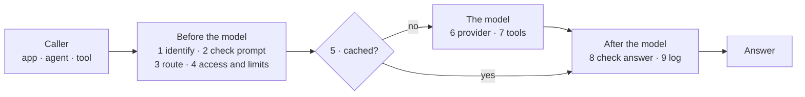

```mermaid
flowchart LR
  A["Caller<br/>app · agent · tool"] --> B["Before the model<br/>1 identify · 2 check prompt<br/>3 route · 4 access and limits"]
  B --> C{"5 · cached?"}
  C -- no --> D["The model<br/>6 provider · 7 tools"]
  D --> E["After the model<br/>8 check answer · 9 log"]
  C -- yes --> E
  E --> F["Answer"]
```
